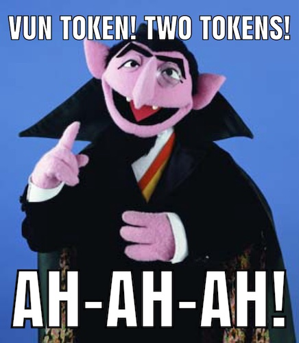

# ah-ah-ah

[](https://github.com/claylo/ah-ah-ah/actions/workflows/ci.yml)
[](https://crates.io/crates/ah-ah-ah)
[](https://docs.rs/ah-ah-ah)
[](https://github.com/claylo/ah-ah-ah)

Offline token counting for Claude and OpenAI models. No API calls, no network, no latency.

> *VUN token! TWO tokens! Count all the beautiful tokens ... offline! Ah-ah-ah!*

<div align="center">



</div>

## Quick start

```rust
use ah_ah_ah::{Backend, MarkdownDecomposer, count_tokens};

// Raw counting.
let report = count_tokens("Hello, world!", None, Backend::Claude, None);
assert_eq!(report.count, 4);

// With a token budget.
let report = count_tokens("Hello, world!", Some(100), Backend::Claude, None);
assert!(!report.over_budget);

// Markdown-aware counting (respects table cell boundaries).
let md = MarkdownDecomposer;
let table = "| A | B |\n|---|---|\n| 1 | 2 |";
let report = count_tokens(table, None, Backend::Claude, Some(&md));
```

## Backends

### Claude (default)

Greedy longest-match tokenizer built from 38,360 API-verified Claude 3+ token
strings, using an Aho-Corasick automaton. The vocabulary was reverse-engineered
by probing the Anthropic `count_tokens` API ~485,000 times (see
[ctoc](https://github.com/nichochar/ctoc) and the vocabulary recovery work in
[the fork that produced this dataset](https://github.com/claylo/ctoc/tree/extended-vocab)).

**No merge table** — just greedy leftmost-longest matching. This is surprisingly
effective: BPE's merge rules tend to produce tokens that are also the longest
matches at each position.

### OpenAI

Exact o200k_base BPE encoding via [bpe-openai](https://crates.io/crates/bpe-openai).
This is the tokenizer used by GPT-4o, GPT-4.5, and o-series models.

## Accuracy

Measured against the Anthropic `count_tokens` API on 18 diverse test strings
(English prose, source code, URLs, JSON, CJK, emoji, markdown):

| Category | Behavior | Typical delta |
|----------|----------|---------------|
| ASCII text & code | Near-exact | 0 to -2 tokens |
| Latin prose | Mild overcount | +5-10% |
| CJK characters | Significant overcount | +50-80% |
| Emoji | Significant overcount | +30-40% |

### Why overcounting happens

The vocabulary contains 33,339 ASCII tokens but only 3,156 Unicode tokens.
When the greedy tokenizer encounters a byte sequence not in the vocabulary, each
**unmatched byte is counted as one token**. A single CJK character is 3 UTF-8
bytes, so an unknown CJK character costs 3 tokens in our count vs 1 in the real
tokenizer.

This is the **safe direction** for budget enforcement — you'll never accidentally
exceed a context window. Your budget estimates will be conservative.

### Why undercounting happens (rare)

On some ASCII inputs, greedy longest-match produces 1-2 *fewer* tokens than
the real BPE tokenizer. This happens when BPE's learned merge order splits text
differently than left-to-right greedy — the greedy approach occasionally finds
a more compact segmentation that BPE's bottom-up merge rules don't.

Undercounting is rare (typically -1 to -2 on strings of 20+ tokens) and
concentrated in:
- Punctuation-heavy text (JSON, markdown tables, error messages)
- Strings mixing digits with special characters (`$42.99`)

For budget enforcement, add a small safety margin (2-3%) if your content is
punctuation-heavy.

### Accuracy by content type

| Content | Example | Delta |
|---------|---------|-------|
| English greeting | `Hello, world!` | 0 (exact) |
| English sentence | `The quick brown fox...` | 0 (exact) |
| Rust code | `fn main() { println!(...) }` | -1 |
| SQL query | `SELECT u.name, COUNT(*)...` | 0 (exact) |
| URL | `https://example.com/path/...` | 0 (exact) |
| ISO timestamp | `2026-03-16T14:30:00.000Z` | 0 (exact) |
| JWT fragment | `eyJhbGciOiJIUzI1NiIs...` | 0 (exact) |
| Rust (complex) | `fn count(&self, text: &str...)` | +2 |
| JSON | `{"name": "test", ...}` | -2 |
| Latin prose | `Lorem ipsum dolor sit amet...` | +7 |
| CJK | `こんにちは世界` | +6 |
| Emoji | `🌍🚀✨` | +3 |

## Decomposer

Structured content like markdown tables can cause greedy tokenizers to match
tokens spanning cell boundaries (e.g., matching `| A` as a single token when
`|` and ` A` should be separate). The `Decomposer` trait lets you plug in
boundary-aware counting.

`MarkdownDecomposer` is included — it uses pulldown-cmark to find tables, splits
rows on `|`, and counts each cell independently. A fast-path heuristic skips
the parser entirely for content without table separator rows (`|---|`), so source
code with pipes (match arms, closures, shell pipes) doesn't pay the parsing cost.

```rust
use ah_ah_ah::{Backend, Decomposer, count_tokens};

// Custom decomposer example.
struct CsvDecomposer;

impl Decomposer for CsvDecomposer {
    fn count(&self, text: &str, raw_count: &dyn Fn(&str) -> usize) -> usize {
        text.lines()
            .map(|line| {
                let commas = line.bytes().filter(|&b| b == b',').count();
                let cells: usize = line.split(',').map(|c| raw_count(c)).sum();
                commas + cells
            })
            .sum()
    }
}
```

## Smoke testing against the API

`scripts/gen-token-fixtures.sh` compares ah-ah-ah counts against the live
Anthropic `count_tokens` API (via Claude Code CLI). It measures a baseline
overhead, subtracts it, and prints a comparison table:

```
TEXT                                                          AH-AH     API  DELTA
Hello, world!                                                     4       4     0
The quick brown fox jumps over the lazy dog.                     11      11     0
こんにちは世界                                                    13       7    +6
```

Requires: `claude` CLI with valid auth, `jq`, and a built `cargo build --example count`.

## License

Licensed under either of:

- Apache License, Version 2.0 ([LICENSE-APACHE](LICENSE-APACHE))
- MIT license ([LICENSE-MIT](LICENSE-MIT))

at your option.
